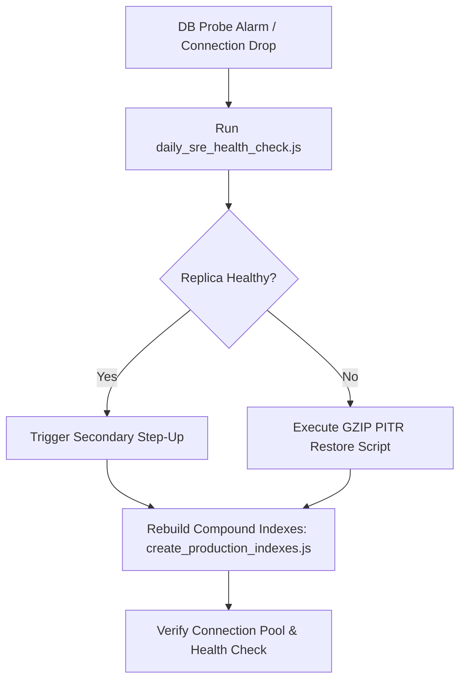

# Standard Operating Procedure (SOP): Municipal Incident Response Runbook

**Platform**: Smart Civic Municipal AI & Grievance Governance Platform  
**Target Release**: `v1.0.0` (Commit: `37cab4e`)  
**Target Audience**: Principal SREs, Cloud Infrastructure Architects, On-Call Engineers & Municipal Incident Commanders

---

## Severity Classification Matrix

| Severity | Criteria | SLA Response | Escalation Level |
|---|---|:---:|---|
| **SEV-1** | Database drop, zero-trust breach, civic intake offline | < 5 Minutes | Municipal Incident Commander |
| **SEV-2** | Queue congestion (>5,000 ceiling), worker CrashLoop, HPA surge | < 15 Minutes | Lead SRE / DevOps Lead |
| **SEV-3** | Degraded third-party integrations (SMS/Maps), transient errors | < 60 Minutes | On-Call Systems Engineer |

---

## Section 1: Primary Database Failover & Restoration (MongoDB) — SEV-1



### 1.1 Triage & Diagnostics
1. Execute in-cluster telemetry diagnostic probe:
   ```bash
   node server/scripts/daily_sre_health_check.js
   ```
2. Inspect active MongoDB connection metrics:
   - Check if `mongoose.connection.readyState === 1`.
   - Inspect active pool connections (Target baseline: 20–100 connections).
   - Check pod logs for `MongoServerSelectionError` or connection timeout warnings:
     ```bash
     kubectl logs -n smart-civic -l app=smart-civic-backend --tail=100
     ```

### 1.2 Step-by-Step Failover & Point-in-Time Recovery (PITR)
1. **Replica Set Step-Up**: If primary replica is unreachable, trigger automatic failover to the secondary node:
   ```bash
   mongosh --eval 'rs.stepDown(60)'
   ```
2. **Connection String Update**: If switching to a standby cluster, update `k8s/configmap.yaml` and rollout:
   ```bash
   kubectl set env deployment/smart-civic-backend MONGODB_URI="mongodb://standby-mongo:27017/smart-civic" -n smart-civic
   ```
3. **Disaster Recovery GZIP Restore**: If database corruption is detected, execute the cryptographically verified restore drill:
   ```bash
   node server/scripts/test_disaster_recovery_restore.js
   ```
   *Validates 100% record and schema parity across all 17 municipal collections.*

### 1.3 Post-Failover Index Reconstruction
Rebuild all high-performance geospatial and compound indices:
```bash
node server/scripts/create_production_indexes.js
```

---

## Section 2: Distributed Queue Congestion & DLQ Replay (Redis) — SEV-2

### 2.1 Triage & Diagnostics
1. Verify Redis cluster memory and queue depth:
   ```bash
   kubectl exec -it deployment/redis -n smart-civic -- redis-cli info memory
   kubectl exec -it deployment/redis -n smart-civic -- redis-cli zcard jobs:pending
   ```
2. Verify Dead Letter Queue (`jobs:failed`) depth:
   ```bash
   kubectl exec -it deployment/redis -n smart-civic -- redis-cli zcard jobs:failed
   ```

### 2.2 Backlog Clearance & Deadlock Prevention
1. **Worker Identity Lock Verification**: Inspect `server/services/queueService.js` to confirm no stale Redlock keys (`job:lock:<jobId>`) exist.
2. **One-Click Replay in Admin Data Studio**:
   - Navigate to **Admin Data Studio $\rightarrow$ Dead Letter Queue (DLQ) Monitor**.
   - Review sanitized failed task payloads.
   - Click **"Retry All Failed Jobs"** (`POST /api/admin/queues/retry/all`).
3. **Fallback Mode Verification**: In the event of an extended Redis outage, confirm that in-memory queuing activates without dropping incoming citizen tickets.

---

## Section 3: Zero-Trust Security Breach & PII Exposure — SEV-1

### 3.1 Containment & Key Rotation
1. **Immediate JWT Secret Invalidation**:
   Update `k8s/secrets-template.yaml` with a freshly generated cryptographic entropy string:
   ```bash
   kubectl create secret generic smart-civic-secrets \
     --from-literal=JWT_SECRET=$(openssl rand -hex 64) \
     -n smart-civic --dry-run=client -o yaml | kubectl apply -f -
   ```
2. **Force-Evict Active User Sessions**:
   ```bash
   kubectl exec -it deployment/redis -n smart-civic -- redis-cli keys "session:*" | xargs redis-cli del
   ```
3. **Restart Ingress & Gateway Pods**:
   ```bash
   kubectl rollout restart deployment/smart-civic-backend -n smart-civic
   ```

### 3.2 Dynamic Privacy Shield Validation
1. Verify PII scrubbing and binary EXIF marker stripping:
   ```bash
   node server/scripts/test_mission_critical_hardening.js
   ```
2. Ensure phone numbers (`+91 98*****1223`), emails (`n**********a@mumbai.gov.in`), and Aadhaar identifiers are masked in all public endpoints and CSV/PDF export streams.

---

## Section 4: Kubernetes Pod CrashLoop & Capacity Autoscaling (HPA) — SEV-2

### 4.1 Triage & Security Context Validation
1. Identify crashed pods and reason (`OOMKilled` vs `CrashLoopBackOff`):
   ```bash
   kubectl get pods -n smart-civic -o wide
   kubectl describe pod -l app=smart-civic-backend -n smart-civic
   ```
2. Verify that non-root permissions and read-only filesystem volume mounts comply with the security baseline:
   - Backend/Worker: UID `1001`
   - Frontend NGINX: UID `101`
   - Redis Container: UID `999`

### 4.2 Emergency Horizontal Scaling
During civic emergency weather events (Monsoon / Flooding), override HPA limits to scale backend processing:
```bash
kubectl scale deployment/smart-civic-backend --replicas=15 -n smart-civic
kubectl scale deployment/smart-civic-worker --replicas=10 -n smart-civic
```

---

## Section 5: Incident Escalation, SLA Penalties & Citizen Communication

| Stage | Required Action | Responsible |
|---|---|---|
| **1. Escrow Deficit Freeze** | Freeze defaulting contractor retention funds via `escrowService.js` | Lead Auditor |
| **2. Live Citizen Broadcast** | Transmit real-time banner across WebSocket & mobile push mesh | Comms Officer |
| **3. Root Cause Analysis (RCA)** | Publish immutable RCA audit log with OpenTelemetry trace dumps | Incident Commander |

1. **Contractor Escrow Balance Freeze**: If SLA breach threshold exceeds 4 hours, verify that `server/services/escrowService.js` deducts standard ₹5,000 penalties and locks contractor bidding eligibility.
2. **Citizen Status Ticker Broadcast**: Issue an emergency banner update via `broadcastService.js` to notify citizens of delayed physical verifications in affected municipal wards.
3. **RCA Audit Ledger Generation**: Compile system metrics into the SRE health badge:
   ```bash
   node server/scripts/generate_health_badge.js
   ```

---

## Incident Commander Fast-Command Quick Reference

| Diagnostic / Action Target | Command |
|---|---|
| **Full SRE Health Check** | `node server/scripts/daily_sre_health_check.js` |
| **End-to-End System Audit** | `node server/scripts/test_complete_system_health.js` |
| **Disaster Recovery Restore Drill** | `node server/scripts/test_disaster_recovery_restore.js` |
| **OpenTelemetry Distributed Traces** | `node server/scripts/test_opentelemetry_tracing.js` |
| **Compound Index Reconstruction** | `node server/scripts/create_production_indexes.js` |
